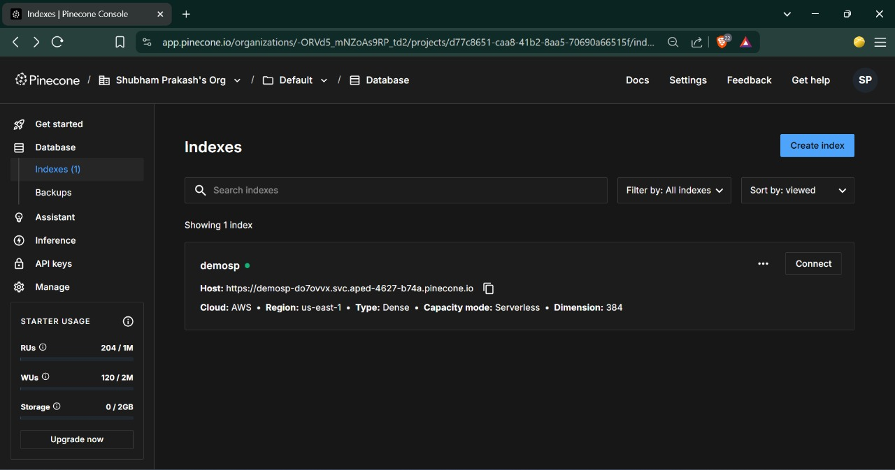

# Natural Language to Pinecone Query Agent

This project provides an API that translates natural language queries into Pinecone vector database queries. It utilizes Google's Gemini for natural language understanding and interacts with a Pinecone index to retrieve relevant data.

Kindly refer to the original Streamlit-based project for more background: 👉 https://github.com/ShubhamPrakash108/streamlit-based

## 🌟 Features
- Natural language query processing.
- Integration with Pinecone vector databases.
- Leverages Google's Gemini for advanced AI capabilities.
- FastAPI backend for robust and scalable API.
- Dockerized for easy deployment and portability.

## 🏗️ System Architecture


*Complete system architecture showing data flow from CSV input to query results.*

The diagram above illustrates the flow:
1.  **Input**: Data can be initially sourced from CSV files.
2.  **Embedding & Indexing**: This data is processed, embedded, and stored in a Pinecone vector index.
3.  **User Query**: A user submits a natural language query via the API.
4.  **Query Translation**: Google's Gemini model translates the natural language query into a format suitable for Pinecone.
5.  **Pinecone Search**: The translated query is used to search the Pinecone index.
6.  **Results**: The search results are returned to the user via the API.

## 🚀 Getting Started

### Prerequisites

* Python 3.8 or higher
* A Pinecone account with an active API key and an existing index.
* A Google AI API key (for Gemini integration).
* Docker Desktop installed and running.

### Installation & Setup

There are two ways to run this project: directly using Python and Uvicorn, or using Docker (recommended for ease of use and consistency).

#### Method 1: Running Locally with Python and Uvicorn (Without Docker)

1.  **Clone Repository:**
    ```bash
    git clone https://github.com/ShubhamPrakash108/bridged-demo-docker.git
    cd bridged-demo-docker
    ```

2.  **Create and Activate Virtual Environment:**
    ```bash
    python -m venv venv
    ```
    * On Windows:
        ```bash
        venv\Scripts\activate
        ```
    * On macOS/Linux:
        ```bash
        source venv/bin/activate
        ```

3.  **Install Dependencies:**
    ```bash
    pip install -r requirements.txt
    ```

4.  **Configure Credentials:**
    You'll need to provide your Pinecone API key, index name, and the metric used for your Pinecone index. You can do this by running the `enter_details.py` script:
    ```bash
    python enter_details.py
    ```
    Follow the prompts to enter your details. This will create a `config.json` file for Pinecone credentials:
    ```json
    {
      "api_key": "YOUR_PINECONE_API_KEY",
      "index_name": "YOUR_PINECONE_INDEX_NAME",
      "metric": "YOUR_PINECONE_METRIC" // e.g., "cosine", "euclidean", "dotproduct"
    }
    ```
   
5.  **Launch API:**
    To run the API directly:
    ```bash
    uvicorn app_fastapi:app --host 0.0.0.0 --port 8000 --reload
    ```
    The API will be accessible at `http://127.0.0.1:8000/docs`.

#### Method 2: Running with Docker (Recommended)

1.  **Clone Repository:**
    ```bash
    git clone https://github.com/ShubhamPrakash108/bridged-demo-docker.git
    cd bridged-demo-docker
    ```

2.  **Ensure Docker Desktop is Running:**
    Install Docker Desktop and ensure the Docker engine (container) is running.
    
    *(Illustrative image of Docker Desktop in a running state)*

3.  **Configure Pinecone Credentials:**
    Run the `enter_details.py` script to create the `config.json` file. This script will prompt you to enter your Pinecone API key, index name, and metric. These details will be saved in `config.json` and used by the application inside the Docker container.
    ```bash
    python enter_details.py
    ```
    After entering the credentials, a `config.json` file will be created in the project's root directory.
    
    *(Illustrative image of the config.json file)*


4.  **Build the Docker Image:**
    This command builds the Docker image. The `--no-cache` flag ensures a fresh build.
    ```bash
    docker build --no-cache -t bridged-fastapi .
    ```
    * This process might take some time (approx. 8-9 minutes) and consume disk space as it downloads necessary dependencies and sets up the environment.
    * After a successful build, the image `bridged-fastapi` will appear in your Docker Desktop images list.
        
        *(Illustrative image of Docker Desktop showing the newly created image)*

5.  **Run the Docker Container:**
    This command runs the Docker container, mapping port 8000 of the container to port 8000 on your host machine.
    ```bash
    docker run -p 8000:8000 bridged-fastapi
    ```
    You should see logs in your terminal indicating that the Uvicorn server has started and the data is being uploaded/processed within the container.

6.  **Access the API:**
    Once the container is running, open your web browser and navigate to the specific API documentation page:
    `http://127.0.0.1:8000/docs#/default/query_vector_db_query_post`

    You will see the FastAPI Swagger UI, focused on the query endpoint.
    
    *(Illustrative image of the API documentation page for the query endpoint)*

7.  **Execute a Query:**
    * On the Swagger UI page for the `/query` endpoint, click on "Try it out".
    * Modify the request body. You will need to enter your natural language `query`. The `api_key` and `index_name` fields in the request body are for Pinecone; ensure these match your setup if not automatically picked up from the server's `config.json`.
        ```json
        {
          "query": "Your natural language query here",
          "api_key": "YOUR_PINECONE_API_KEY", // Or ensure server uses config.json
          "top_k": 5,
          "index_name": "YOUR_PINECONE_INDEX_NAME" // Or ensure server uses config.json
        }
        ```
    * Click "Execute".
        
        *(Illustrative image of executing a query in Swagger UI)*

8.  **View Response:**
    The API response, containing the query results from Pinecone, will be displayed below in the Swagger UI.
    
    *(Illustrative image of the API response)*
    You can also see logs in your terminal where you ran the `docker run` command.
    
    *(Illustrative image of the response logged in the terminal)*

## 🌲 Pinecone Index Details
Ensure your Pinecone index (e.g., `demosp`) is set up correctly with the appropriate dimensions (e.g., 384) and metric (e.g., cosine). The application will connect to the index specified in your `config.json`.

*(Illustrative image of a Pinecone index in the Pinecone console)*

## ⚙️ API Endpoints

* **`POST /query`**: (Accessible at `http://127.0.0.1:8000/docs#/default/query_vector_db_query_post`)
    * **Description**: Accepts a natural language query and returns matching results from the Pinecone vector database.
    * **Request Body**:
        ```json
        {
          "query": "string (natural language query)",
          "api_key": "string (Pinecone API key - ideally sourced from server-side config)",
          "top_k": "integer (optional, number of results to return, default: 5)",
          "index_name": "string (Pinecone index name - ideally sourced from server-side config)"
        }
        ```
    * **Response**:
        ```json
        {
          "query": "string (original query)",
          "results": [
            // list of result objects from Pinecone
          ]
        }
        ```

## Troubleshooting

* **Docker Build Fails**:
    * Ensure you have enough disk space.
    * Check your internet connection.
    * Verify the `Dockerfile` syntax and that all required files (like `requirements.txt`, `config.json` if copied during build) are present in the build context.
* **Docker Run Fails or Container Exits Immediately**:
    * Check the container logs: `docker logs <container_id_or_name>`. This often reveals errors related to missing configurations (like `config.json` not being accessible or incorrect, or missing Google API Key) or issues within the application startup.
    * Ensure `config.json` is correctly formatted and accessible to the application inside the container.
    * Verify that the Google AI API Key is correctly made available to the application's environment within the container.
* **API Errors (e.g., 4xx or 5xx)**:
    * Check the Uvicorn server logs in the terminal (or Docker container logs).
    * Ensure your Pinecone API key, index name, and metric in `config.json` are correct and the index exists.
    * Ensure your Google AI API key (if used for Gemini features) is valid, accessible to the application, and has the necessary permissions.
    * Verify the query format and parameters sent to the API.

## Contributing

Contributions are welcome! Please feel free to submit a pull request or open an issue for any bugs, feature requests, or improvements.
